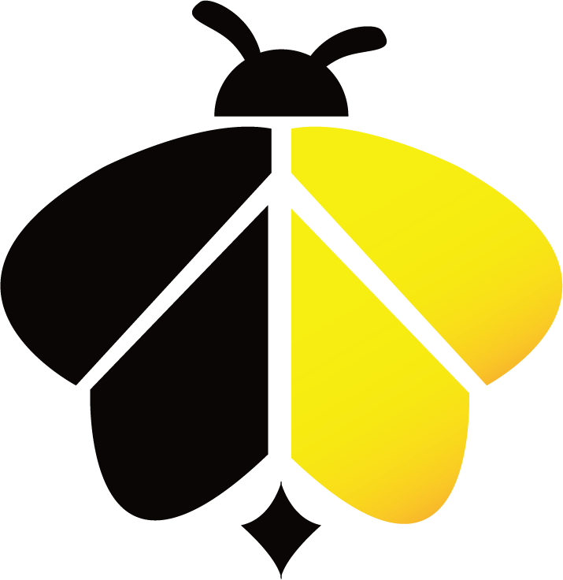
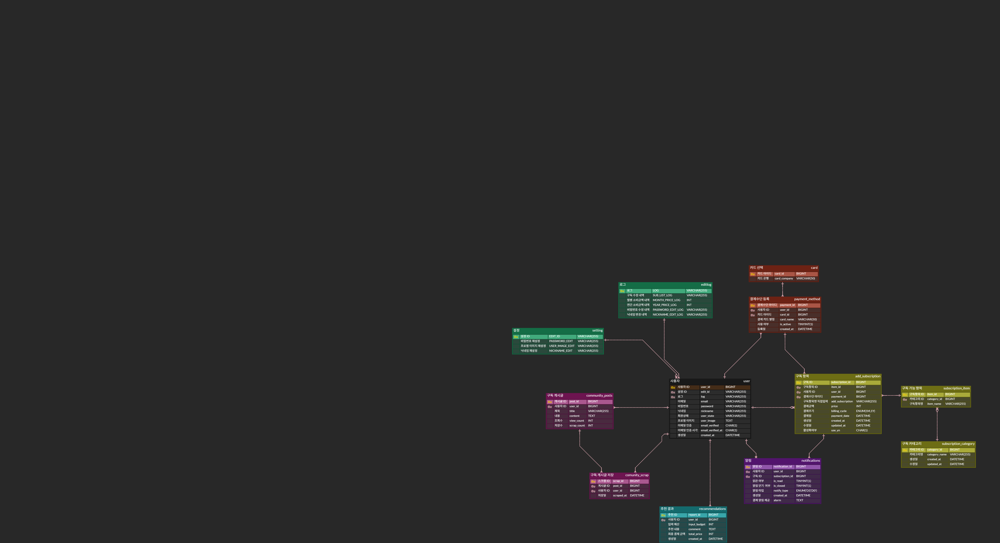
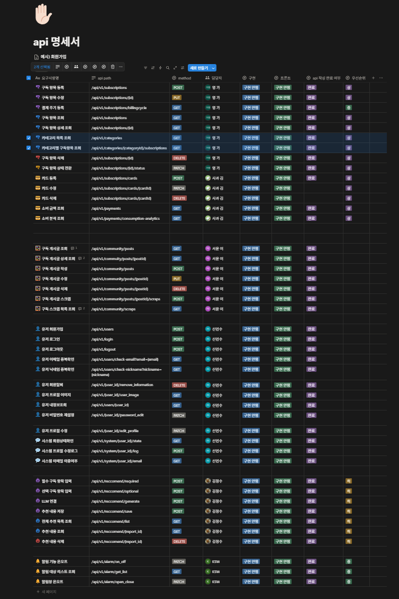

 

  

흩어진 구독시스템을 한번에 
효율을 높이는 통합 구독 관리 플랫폼
  
***Subees_project***

  

---

## 👥 팀원 소개

<table align="center">
  <tr>
    <td align="center" width="180">
      
       
      <b>조장: 김가영</b>
       
      
    </td>

  <td align="center" width="180">
      
       
      <b>김다솜</b>
       
      
    </td>

  <td align="center" width="180">
      
       
      <b>김승욱</b>
       
      
    </td>

  <td align="center" width="180">
      
       
      <b>김정수</b>
       
      
    </td>

  <td align="center" width="180">
      
       
      <b>신민수</b>
       
      
    </td>

  <td align="center" width="180">
      
       
      <b>이서윤</b>
       
      
    </td>
  </tr>
</table>

---

## 📚 Back-end Repository 목차

- [📌 프로젝트 개요](#프로젝트-개요)
- [🎯 서비스 목표](#서비스-목표)
- [📖 프로젝트 시나리오](#프로젝트-시나리오)
- [🧾 요구사항 명세서](#요구사항-명세서)
- [🗺️ ERD](#erd)
- [📋 테이블 명세서 및 제약 조건](#테이블-명세서-및-제약-조건)
- [🏗️ 시스템 아키텍처](#시스템-아키텍처)
- [📑 API 명세서](#api-명세서)
- [✅ 개발 산출물 및 검증](#개발-산출물-및-검증)
- [화면 설계서](#화면설계서)
- [📄 SQL 산출물](#sql-산출물)
- [🧪 API 단위 테스트 결과서](#api-단위-테스트-결과서)
- [📝 프로젝트 마무리 회고 및 향후 확장 계획](#프로젝트-마무리-회고-및-향후-확장-계획)

---

<b>📌 프로젝트 개요</b>

 

- **서비스 명칭:** Subees
- **서비스 소개:**  
  Subees는 여러 플랫폼에 분산되어 있는 구독 정보를 한곳에서 통합 관리하고, 결제일, 구독 금액, 결제 주기 등을 한눈에 확인할 수 있도록 지원하는 통합 구독 관리 서비스입니다.
- **프로젝트 목적:**  
  사용자가 구독 서비스 이용 과정에서 발생할 수 있는 지출 누락, 중복 결제, 무료체험 종료 후 자동 결제 등의 문제를 줄이고, 소비 패턴 분석과 알림 기능을 통해 더욱 합리적인 소비를 할 수 있도록 돕는 것을 목표로 합니다.
- **주요 제공 가치:**  
  구독 등록 및 관리, 결제 예정 알림, 월별·카테고리별 소비 분석, 사용자 맞춤형 추천 기능을 통해 구독 피로도를 낮추고 지출을 효율적으로 관리할 수 있도록 지원합니다.

---

<b>🎯 서비스 목표</b>

 

- 사용자 구독 정보와 결제 데이터를 통합 관리할 수 있는 백엔드 시스템을 구축합니다.
- 결제일, 금액, 주기 등 핵심 데이터를 안정적으로 관리하여 구독 현황 조회와 소비 분석 기능을 지원합니다.
- 알림, 분석, 추천 기능에 필요한 데이터를 일관성 있게 제공하여 서비스의 확장성과 활용도를 높입니다.

---

<b>📖 프로젝트 시나리오</b>

 

  

1. 사용자는 서비스 접속 후 회원 여부에 따라 회원가입 또는 로그인을 진행합니다.
2. 비회원은 이용약관 동의, 회원가입, 이메일 인증을 완료한 뒤 로그인합니다.
3. 로그인한 사용자는 권한에 따라 일반 사용자 기능 또는 관리자 기능으로 분기됩니다.
4. 일반 사용자는 메인 화면에서 대시보드, 구독 목록, 마이페이지, 커뮤니티, 챗봇 기능을 이용할 수 있습니다.
5. 대시보드에서는 월별 소비 내역, 소비 차트, 카테고리별 분석, 캘린더 기반 소비 조회 기능을 제공합니다.
6. 구독 목록에서는 구독 서비스 등록, 조회, 수정, 삭제 기능을 수행할 수 있습니다.
7. 마이페이지에서는 프로필 정보와 비밀번호를 수정할 수 있습니다.
8. 커뮤니티에서는 게시글 조회, 작성, 수정, 삭제 기능을 이용할 수 있습니다.
9. 챗봇에서는 구독 관련 질의응답과 추천 기능을 제공합니다.
10. 관리자는 관리자 전용 기능을 통해 게시글 관리, 구독 목록 관리, 운영 로그 확인, 버그 수정 및 업데이트를 수행합니다.

---

<b>🧾 요구사항 명세서</b>

 

- [요구사항 명세서 바로가기](https://docs.google.com/spreadsheets/d/1t28YAF3teou6grdUzRbnRs2NyKi5boFY/edit?usp=sharing&ouid=102208872170708224187&rtpof=true&sd=true)

---

<b>🗺️ ERD</b>

 

- [ERD 바로가기](https://www.erdcloud.com/d/osSpqKzTmS8zueTJs)

  

**주요 관계**
- `user` 1 : N `add_subscription`
- `user` 1 : N `payment_method`
- `user` 1 : N `notifications`
- `user` 1 : N `community_posts`
- `user` 1 : N `community_scrap`
- `user` 1 : N `recommendations`
- `card` 1 : N `payment_method`
- `payment_method` 1 : N `add_subscription`
- `subscription_category` 1 : N `subscription_item`
- `subscription_item` 1 : N `add_subscription`
- `community_posts` 1 : N `community_scrap`

---

<b>📋 테이블 명세서 및 제약 조건</b>

 

- [테이블 명세서 바로가기](https://docs.google.com/spreadsheets/d/1t28YAF3teou6grdUzRbnRs2NyKi5boFY/edit?usp=sharing&ouid=102208872170708224187&rtpof=true&sd=true)

**테이블 설계 설명**  
본 테이블 설계는 `user`를 중심으로 구독 관리, 결제수단 관리, 커뮤니티, 알림, 추천 기능이 유기적으로 연결되도록 구성하였습니다.

- `user`: 회원 기본 정보 관리
- `add_subscription`: 사용자 구독 정보 관리
- `subscription_item`, `subscription_category`: 구독 항목 및 카테고리 관리
- `payment_method`, `card`: 사용자 결제수단 및 카드사 정보 관리
- `community_posts`, `community_scrap`: 게시글 및 스크랩 기능 관리
- `notifications`: 결제 알림 및 상태 관리
- `recommendations`: 예산 기반 추천 결과 저장
- `setting`, `editlog`: 설정 변경 및 수정 이력 관리

**주요 제약 조건**
- **UNIQUE**: 이메일, 닉네임 중복 방지
- **CHECK**: 금액, 성별 등 입력값 유효성 검증
- **FOREIGN KEY**: 사용자 및 구독 관련 테이블 간 관계를 설정하여 데이터 무결성을 보장합니다.

---

<b>🏗️ 시스템 아키텍처</b>

 

- [시스템 아키텍처 바로가기](https://app.cloudcraft.co/view/65bc3092-5496-4d52-adb4-1ba4d1d7a0ac?key=4c22b50e-a162-4c2f-89c3-520f55bc47e1)

  

---

<b>📑 API 명세서</b>

 

- [API 명세서 바로가기](https://www.notion.so/api-31e712dca4bf807e97fbe583efc7e99e?source=copy_link)

  

**API 명세서 설명**  
Subees의 API는 구독 관리, 결제 및 소비 분석, 커뮤니티, 회원 및 인증, 추천, 알림 기능으로 구분하여 설계하였습니다.  
구독 도메인에서는 구독 등록·수정·삭제·조회와 카드 및 카테고리 관리 기능을 제공하고, 결제 도메인에서는 소비 금액 및 소비 내역 분석 기능을 지원합니다.  
커뮤니티 도메인에서는 게시글 CRUD와 스크랩 기능을 제공하며, 회원 도메인에서는 회원가입, 로그인, 중복 확인, 프로필 수정, 회원 탈퇴 기능을 담당합니다.  
또한 추천 도메인에서는 사용자 입력 기반 추천 생성과 결과 저장·조회 기능을 제공하고, 알림 도메인에서는 알림 설정 및 알림 내역 관리 기능을 처리하도록 구성하였습니다.

---

<b>✅ 개발 산출물 및 검증</b>

 

프로젝트 개발 과정에서 생성된 주요 산출물과 검증 결과를 아래 항목에 정리할 예정입니다.

---

<b>📄 SQL 산출물</b>

 

- **내용:** DDL, 핵심 프로시저, 트리거
- **설명:** 데이터베이스 구조 정의와 주요 동작 로직을 정리할 예정입니다.
- **상태:** 추후 작성 예정

---

<b>📄 화면설계서 </b>

 

-[화면설계서 바로가기](https://www.figma.com/design/8EOuGl8Jxtz5RJapDro4ky/Subees-%ED%99%94%EB%A9%B4-%EB%B0%8F-%EA%B8%B0%EB%8A%A5%EC%84%A4%EA%B3%84%EC%84%9C-%EC%8A%A4%EC%BC%88%EB%A0%88%ED%86%A4-?node-id=171-498&t=FHeZP6i194wx87xW-1)

---

<b>🧪 API 단위 테스트 결과서</b>

 

- **내용:** DB 적재 확인 및 조회 쿼리 증빙
- **설명:** API 요청 결과와 데이터 반영 여부를 검증한 내용을 정리할 예정입니다.
- **상태:** 추후 작성 예정

---

<b>📝 프로젝트 마무리 회고 및 향후 확장 계획</b>

 

- 프로젝트 진행 과정에서의 개선점과 협업 회고를 정리할 예정입니다.
- 향후에는 추천 로직 고도화, 알림 자동화, 사용자 맞춤 분석 기능 확장을 목표로 합니다.

